# 💰 Saving Management System
 
## 🧾 Project Overview

The **Saving Management System** is a web-based application designed to manage savings accounts efficiently. This system allows users to handle savings certificates, account management, reports, and regulatory changes. The project is built using PHP, CSS, and JavaScript for the frontend, while the backend is powered by Spring Boot.

> 🎓 *This project was developed as the final term assignment for the Introduction to Software Engineering - SE104 course in the Software Engineering department at UIT, receiving a score of **9.5/10**.*

## 👥 Team Members

| ID        | Name         | Contribution %  |
| :-------- | :----------- | :-------------- |
| 22520031  | Trần Thúy An | 100 |
| 22520046  | Huỳnh Thị Ngọc Ánh | 100 |
| 22520112  | Nguyễn Thái Bảo | 100 |
| 22520168  | Huỳnh Lê Quốc Công | 100 |
| 22520072  | Nguyễn Lê Tuấn Anh | 100 |

## ✨ Features

- 🏠 **Home Page**: Overview of the system with key statistics.
- 👤 **Account Management**: Create, update user accounts.
- 💳 **Savings Management**: Manage savings, including creation, tracking, and updates.
- 📊 **Reports**: Generate detailed reports on savings data.
- ⚙️ **Regulation Changes**: Modify system rules and regulations as needed.

## 🧬 ERD
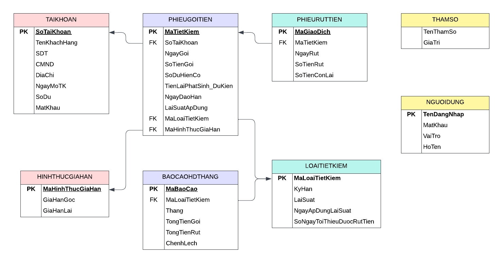


## 🌐 Demo Web

> 🔐 Choose role and log in:
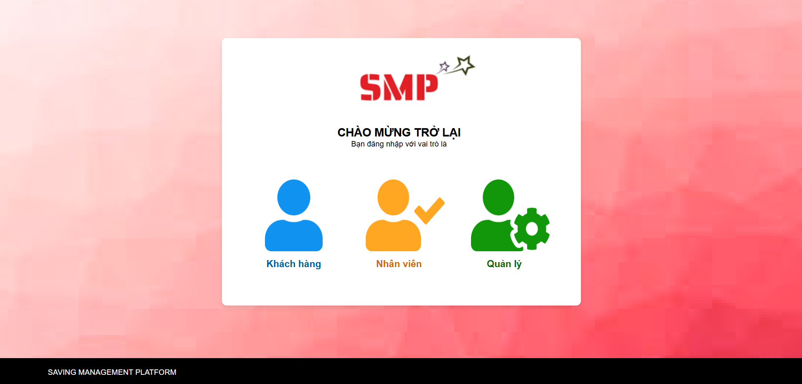
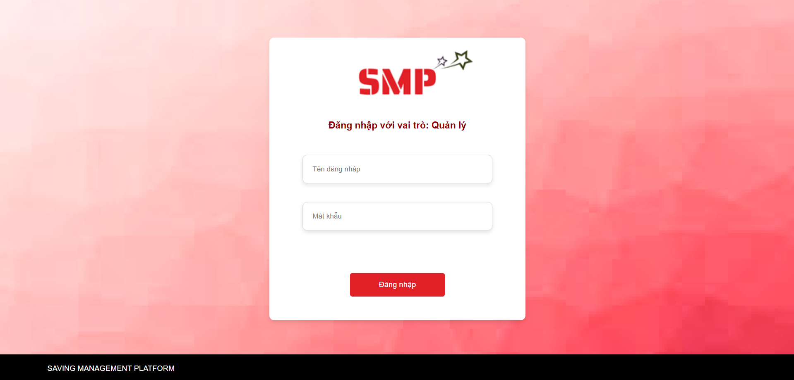

---------------


### 👨‍💼 Manager

- 📊 Dashboard  
  

- 👥 List Account  
  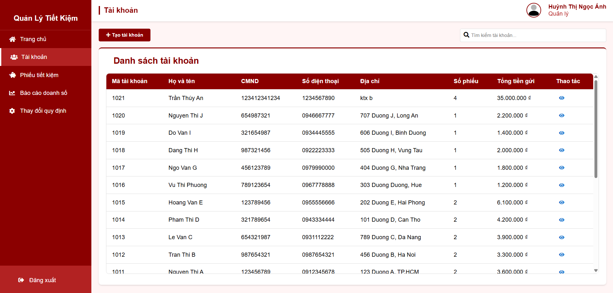

- ➕ Create Account  
  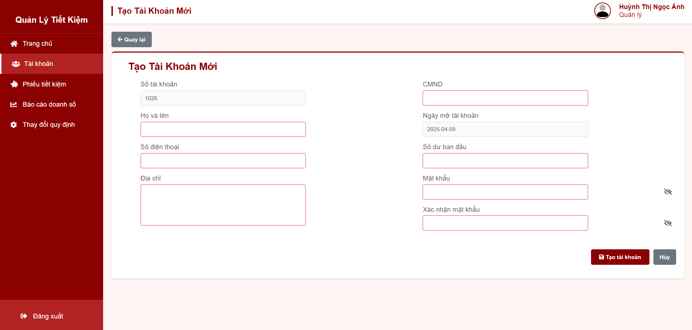

- 📁 List Saving  
  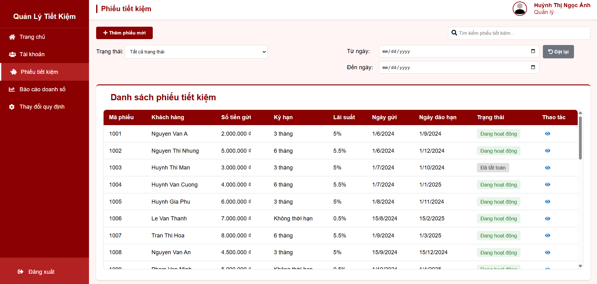

- ➕ Create Saving  
  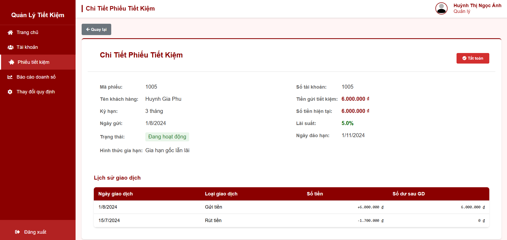

- 🔍 Saving Detail  
  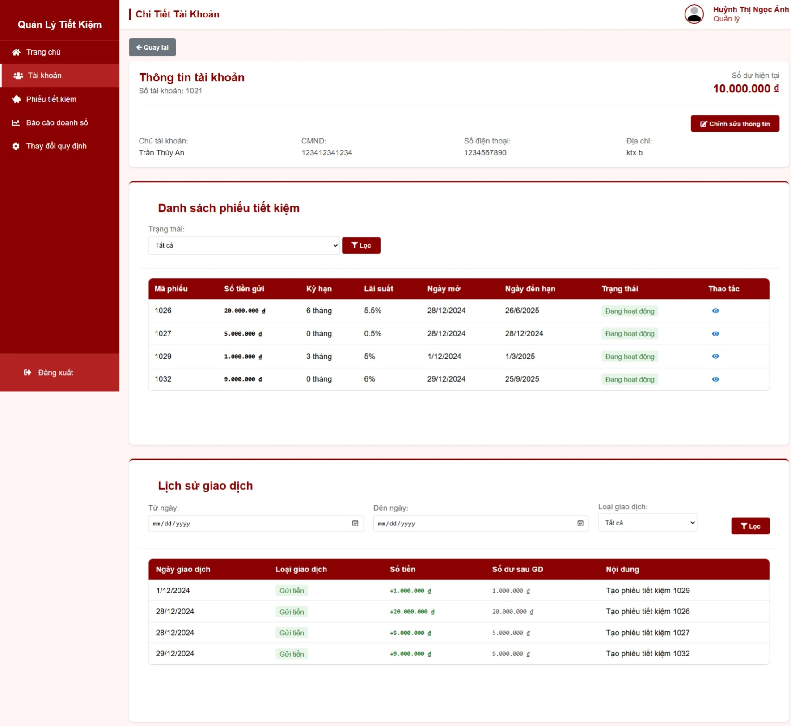

- 💸 Withdraw  
  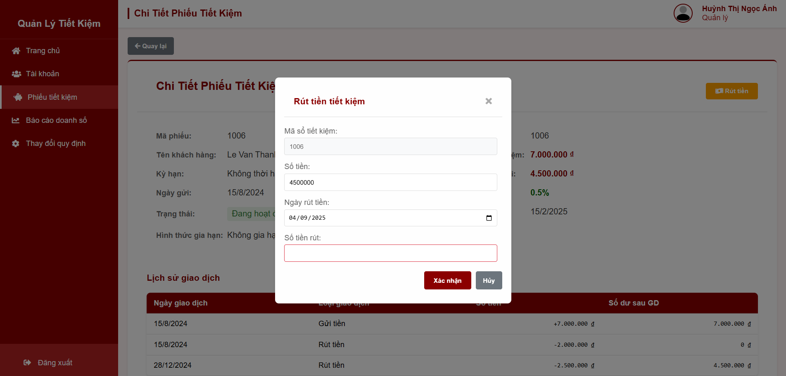

- ✅ Settlement  
  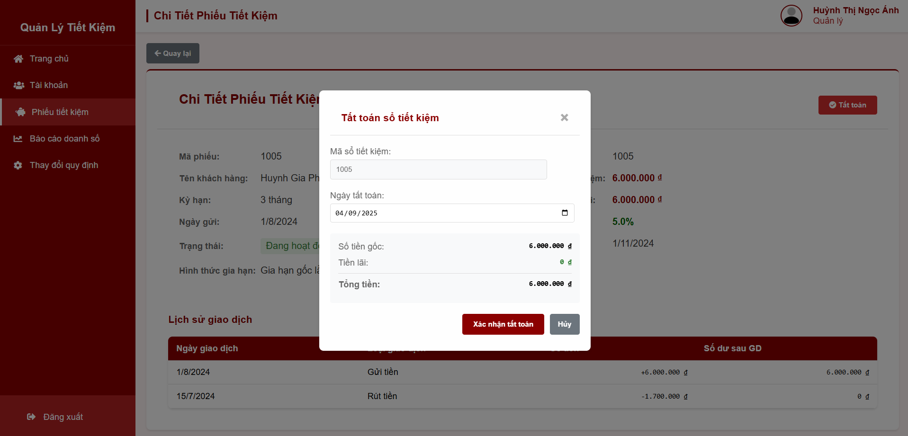

- 📈 Report  
  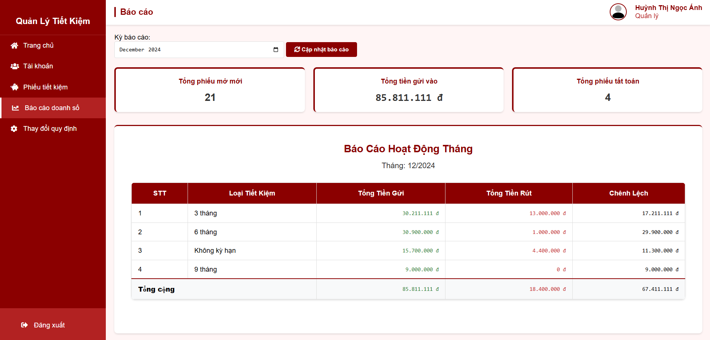

- 🔧 Change Rule  
  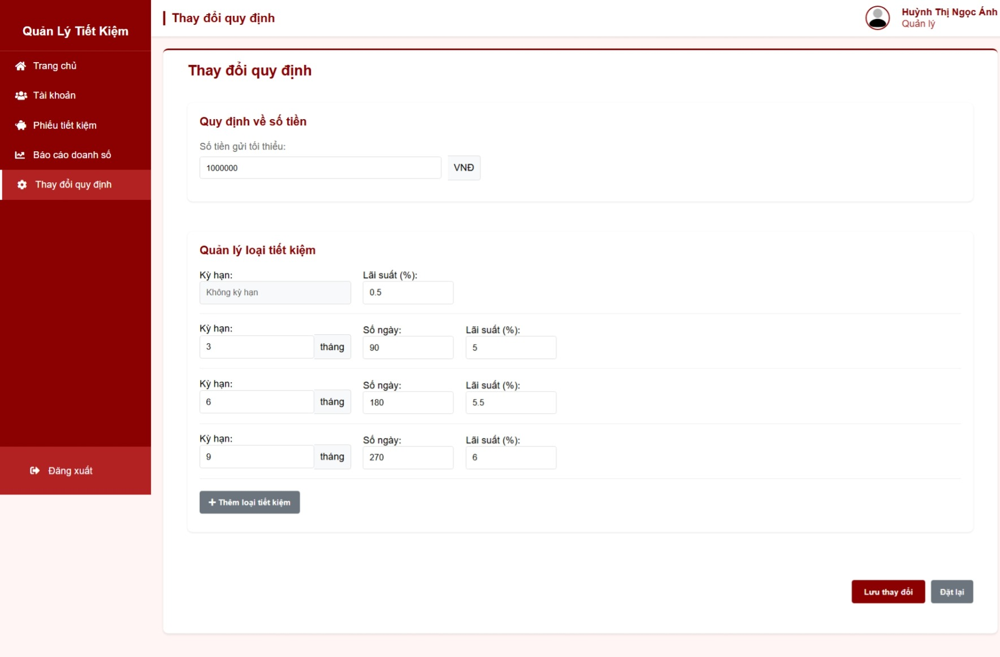


### 👨‍💼 Employee

- 📊 Dashboard  
  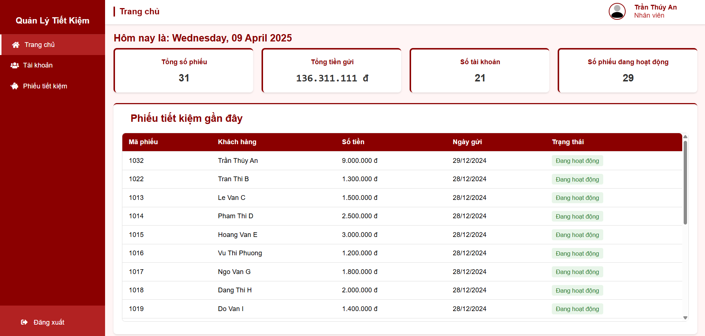

---

### 👨‍💼 Customer

- 🔍 Saving Detail  
  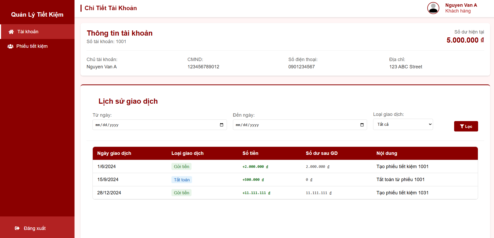

## 🛠️ Technologies Used
> * Programming Languages: `Java`, `PHP`, `JavaScript`, `CSS`
> * Backend Frameworks: `Spring Boot` (Java)
> * Frontend Tools: `HTML`, `CSS`, `JavaScript`
> * IDEs & Code Editors: `IntelliJ IDEA`, `Visual Studio Code`
> * Database: `MySQL`
> * Local Server: `XAMPP`
> * Version Control: `Git`
> * Source Code Management: `GitHub`

## 🚀 Installation Guide

### 📌 Prerequisites
1. [XAMPP](https://www.apachefriends.org/index.html)
2. [IntelliJ IDEA](https://www.jetbrains.com/idea/)
3. [Git](https://git-scm.com/)
4. [Java JDK 17+](https://www.oracle.com/java/technologies/javase/jdk17-archive-downloads.html)

---

### 🔧 Setup Steps

#### 1️⃣ Clone the Project
```bash
git clone https://github.com/ann-trann/SE104-Savings-Management.git
```
➡️ Place the project in: `C:\xampp\htdocs\`

#### 2️⃣ Setup XAMPP
- Change Apache port to 8080
- Start Apache & MySQL in XAMPP
- Create a database named saving_money
- Import the provided .sql file into saving_money using phpMyAdmin

#### 3️⃣ Setup IntelliJ IDEA
- Open IntelliJ IDEA
- Navigate to: `C:\xampp\htdocs\SE104-Savings-Management\backend\saving-management`
- Open and run the file: `SavingManagementApplication.java`

 #### 4️⃣ Access the Project
- Open your browser and go to: http://localhost:8080/
- Select the project: `SE104-Savings-Management`

👤 Sample Accounts
| Role        | Username / Phone         | Phone	Password |
| :-------- | :----------- | :-------------- |
| Manager  | anhhuynh | 123 |
| Staff  | antran | 123 |
| Customer  | 0901234567 | 123 |

>* ***📝Note:** Refer to the installation guide file below for a clearer understanding: [Detailed Guide File](./demo/huong-dan-chi-tiet)*
